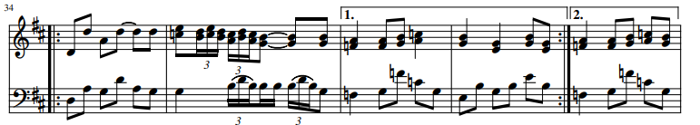
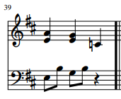

## Introduction for One by Metallica

Today I will be taking a deeper look at the introduction of one of Metallica’s most famous songs “One.” “One” is a very dark and sad song about a man who suffered awful injuries from war and is kept alive in a hospital but wishes to die instead of being left alive. The goal of the introduction is to set the scene for this man as he begins to sing about his pain. If you want more information about the lyrics, they are linked <a href="https://genius.com/Metallica-one-lyrics">here</a> but this post will focus on the music the song opens with. 

To begin, the song is written in B minor. Minor key makes perfect sense for this song since its subject is so dark. The piece begins with a back and forth between the i chord and nondominant seventh chord VI7 except the VI7 chords are missing tonic. The leap from g to f along with the missing tonic creates a feeling of emptiness present in measures 2, 4 and 6. This dichotomy of the VI7 and i broken chord creates a pleasing yet unsettling base introduction to the song. Measure 6 breaks this back and forth between the i and VI7 chord with a III chord which foreshadows a coming change in the music. The low of measure 6 is between g and b which are the lows of the previous measures. The use of a as the low in measure 6 lets the low note take consecutive steps downwards while keeping all other notes the same leading to the abrupt change in the base in measure 8. The change is marked by a switch to 2/4 time signature and then immediately back to 4/4 and a break in the repetition of the low high low med pattern. We have a fast low high low high which creates a strange and short change of pace as the piece goes back to 4/4 and the baseline takes a step back as the melody comes in.
 
 

The baseline for measures 9-16 is the exact same as the baseline for measures 1-8. Nothing new there. However, the melody comes in and uses a lot of stepwise motion with some leaps of a 3rd. There’s only one leap that’s greater than a 3rd which is a 4th in measure 12 as the piece dips downwards. This is super interesting because the baseline loves taking leaps while the melody is filled with passing tones like the commonly used dcb/bcd in measures 10,11,13 and 14. These nonharmonic tones which are also present as neighboring tones such as in measure 12 (ded) create a smooth yet unique melody that's calm but at the same time picks up the pace of the piece. This is then slowed down in measures 13-15 where we then have another abrupt measure 16 in 2/4 that's the same as measure 8 which again signifies a significant change in the music to come. Measure 12 really stands out to me as it brings feelings of nostalgia from my days of playing Guitar Hero III. It sticks out due how fast paced it plays relative to the long notes surrounding it - preceded by a half note and followed by a dotted half note. This is one of my favorite parts of "One" and is one of the parts that always comes to mind when I think of this introduction. 

Next, we look at the last section of what I’d consider the first half of the introduction before we have a change in the melody. The composers of Metallica (James Hetfiled and Lars Ulrich) have this interesting suspension-like drop moving from measure 20 to 21. Then they use a combination of steps and leaps of a 3rd to reach a high point then to only drop back down to b. These musical "lead-ons" keep me wanting more and for the introduction to hit a peak here which it does in measure 22. The steps and leaps break through on the third attempt and the music keeps climbing until it hits e6. 

 

some transition word, 

&nbsp;&nbsp;&nbsp; 

Now, 

&nbsp;

&nbsp;
