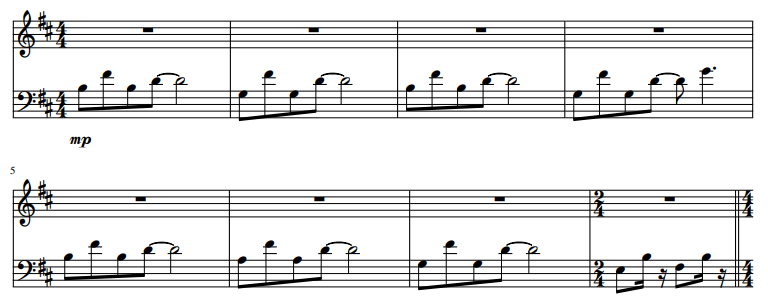
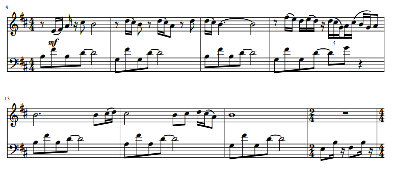
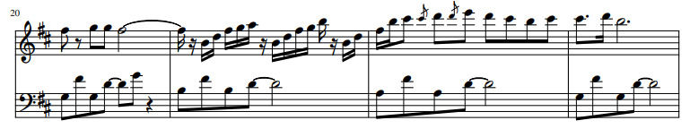
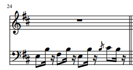
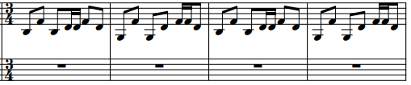

## Introduction for One by Metallica

Today I will be taking a deeper look at the introduction of one of Metallica’s most famous songs “One.” “One” is a very dark and sad song about a man who suffered awful injuries from war and is kept alive in a hospital but wishes to die instead of being left alive. The goal of the introduction is to set the scene for this man as he begins to sing about his pain. If you want more information about the lyrics, they are linked here but this post will focus on the music the song opens with. 

(insert song from youtube)

To begin, the song is written in B minor. Minor key makes perfect sense for this song since its subject is so dark. The piece begins with a back and forth between the i chord and nondominant seventh chord VI7 except the VI7 chords are missing tonic. The leap from g to f along with the missing tonic creates a feeling of emptiness present in measures 2, 4 and 6. This dichotomy of the VI7 and i broken chord creates a pleasing yet unsettling base introduction to the song. Measure 6 breaks this back and forth between the i and VI7 chord with a III chord which foreshadows a coming change in the music. The low of measure 6 is between g and b which are the lows of the previous measures. The use of a as the low in measure 6 lets the low note take consecutive steps downwards while keeping all other notes the same leading to the abrupt change in the base in measure 8. The change is marked by a switch to 2/4 time signature and then immediately back to 4/4 and a break in the repetition of the low high low med pattern. We have a fast low high low high which creates a strange and short change of pace as the piece goes back to 4/4 and the baseline takes a step back as the melody comes in.
 
 

The baseline for measures 9-16 is the exact same as the baseline for measures 1-8. Nothing new there. However, the melody comes in and uses a lot of stepwise motion with some leaps of a 3rd. There’s only one leap that’s greater than a 3rd which is a 4th in measure 12 as the piece dips downwards. 

Next,

Lastly, 

&nbsp;&nbsp 

